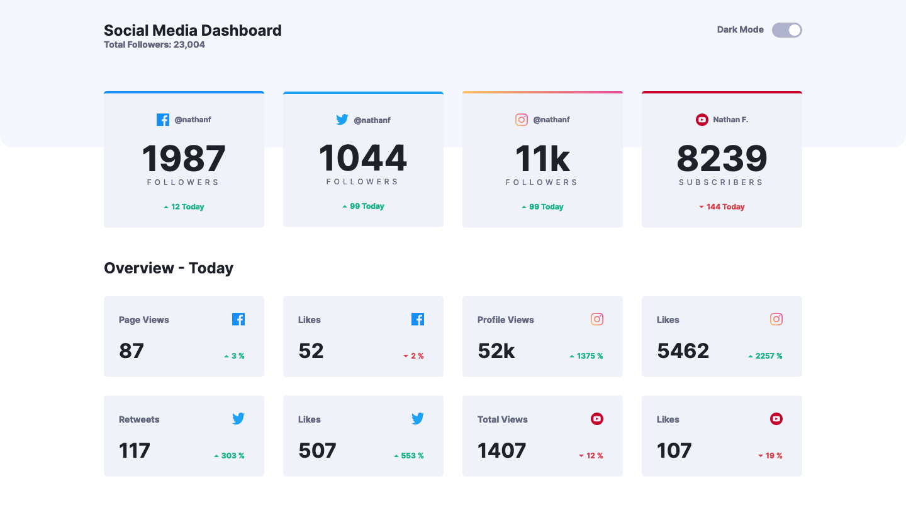
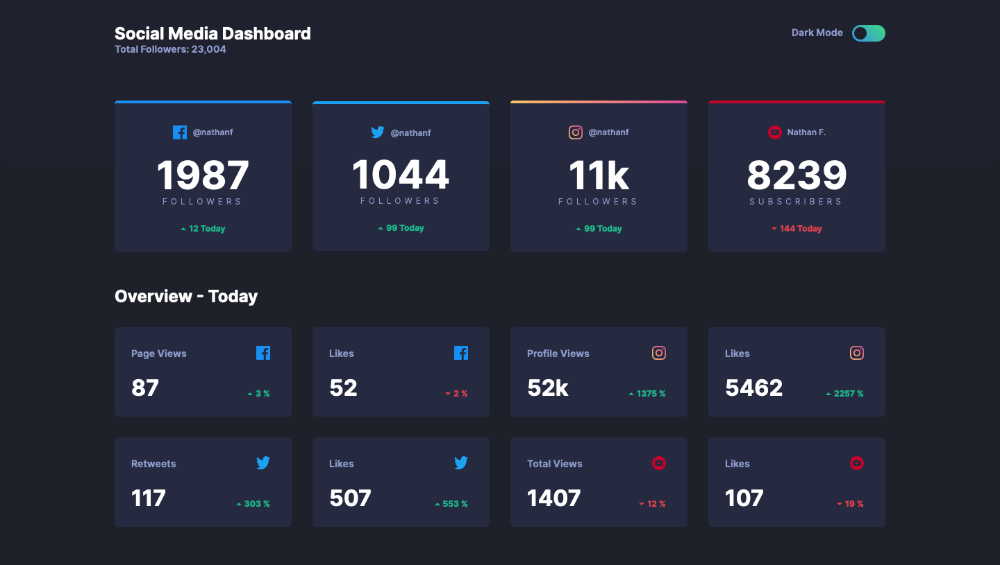

# Frontend Mentor - Social media dashboard with theme switcher solution

This is a solution to the [Social media dashboard with theme switcher challenge on Frontend Mentor](https://www.frontendmentor.io/challenges/social-media-dashboard-with-theme-switcher-6oY8ozp_H). Frontend Mentor challenges help you improve your coding skills by building realistic projects.

## 目次

- [概要](#概要)
  - [チャレンジ](#チャレンジ)
  - [スクリーンショット](#スクリーンショット)
  - [リンク](#リンク)
- [プロセス](#プロセス)
  - [使用したスキル](#使用したスキル)
  - [学んだこと](#学んだこと)
  - [リソース](#リソース)

## 概要

### チャレンジ

ユーザーができること:

- 画面のサイズによって最適なレイアウトが表示される
- ページ上の全てのインタラクティブな要素でホバー状態を見ることができる
- 好みによってカラーテーマを切り替えすることができる

### スクリーンショット




### リンク

- Live Site URL: [リンク](https://your-live-site-url.com)

## プロセス

### 使用したスキル

- CSS custom properties
- Sass
- Flexbox
- CSS Grid
- Mobile-first workflow
- React

### 学んだこと

useReducer, useContext を使って、テーマの切り替えを行なってみた。
useState でも事足りたが、これまで useReducer を使って状態管理をしたことが無かったのでいい機会っだった。
useReducer を使うことで、複雑な状態管理も行うことができそうだ。

```js
const themeReducer = (state, action) => {
	switch (action.type) {
		case 'LIGHT_THEME':
			return { darkTheme: false };

		case 'DARK_THEME':
			return { darkTheme: true };

		default:
			return state;
	}
};

const [state, dispatch] = useReducer(themeReducer, initialState);
```

### 役に立ったリソース

- [REFFECT](https://reffect.co.jp/react/react-hook-reducer-understanding) - useReducer の使い方について知ることができた。
- [Toggle Dark Mode in React](https://dev.to/abbeyperini/toggle-dark-mode-in-react-28c9) - ダークテーマ、ライトテーマの切り替え方について知ることができた。
